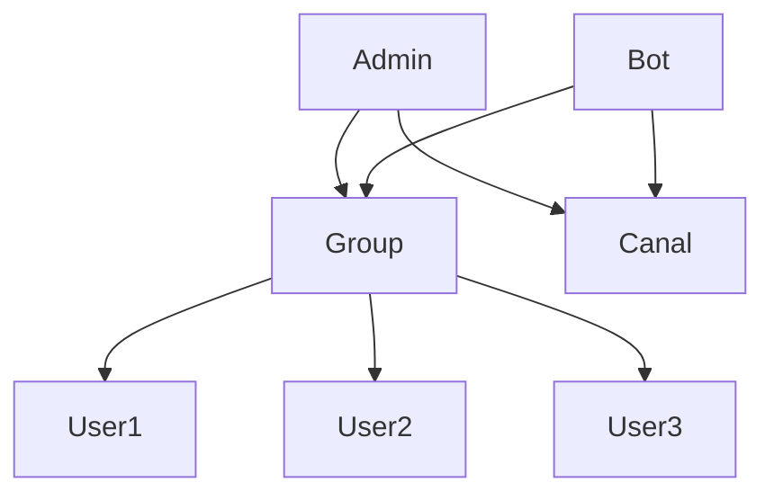

# Алгоритм взаимодействия с ботами

1. Администратор создает группу и правильно настраивает ее:

   - Управление группой
   - Разрешения
   - Ограничение на отправку сообщений

2. Приглашает бота (`https://t.me/geopricebot`).

3. Делает бота администратором (включает бота):

   - Выполняет действие "Включить бота".

4. Создает канал и делает бота администратором.

5. Приглашает остальных пользователей и делает их администраторами:

   - Бот создает список работников.
   - Делает их администраторами.
   - Присваивает должности.

6. Остальные пользователи отправляют личные сообщения боту.

---

- Бот транслирует распознанные команды администратору в личные сообщения или каналы:

  - Используются каналы для трансляции сообщений.

